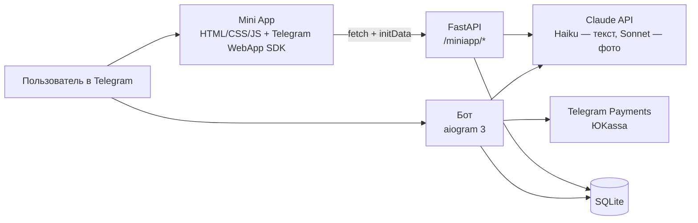

# VetCheck — AI-помощник для владельцев собак и кошек

Telegram-бот [@vetcheckbot](https://t.me/vetcheckbot) со встроенным Mini App для дрессировки. Работает по подписке.

Это витрина проекта: описание, архитектура и решения. Исходный код закрыт, потому что это действующий продукт с пользователями и платежами. Покажу его на созвоне.

## Что умеет

**Вопросы о здоровье питомца.** Владелец описывает симптомы текстом или присылает фото, а бот даёт предварительный разбор: возможные причины и насколько срочно идти к ветеринару.
- Каждый ответ явно помечен как «не диагноз»; при «красных флагах» бот однозначно говорит ехать к врачу и никогда не называет дозировки препаратов.
- Фото симптома бот разбирает, а рентген, УЗИ и КТ не интерпретирует как диагност: описывает снимок нейтрально и просит показать его врачу.
- Медкарта питомца: порода, вес, возраст, хронические болезни, операции и история обращений. Каждый новый вопрос учитывает этот контекст.
- После обращения бот сам спрашивает, как дела у питомца, а напоминания о визите к врачу, вакцинации и лекарствах приходят в заданное время.

**Mini App для дрессировки.**
- Онбординг: кличка, порода, возраст, цели, сколько минут в день есть на занятия.
- 26 программ (адаптация, туалет, кусание, послушание, лай, тревога разлуки, реактивность, программы для кошек и др.), в каждой пошаговые дни с подготовкой, шагами, критерием успеха и типичными ошибками.
- Длительность и формат занятий подстраиваются под породную группу и возраст.
- Прогресс, серия дней подряд, дневник веса, раздел «Здоровье».
- Отдельный режим вопросов по поведению и дрессировке прямо в чате (`/ask`).

**Монетизация.** Бесплатно 2 отчёта в месяц, дальше подписка через Telegram Payments в рублях.

## Архитектура

- **Бот** (aiogram 3, FSM): анкета питомца, медкарта, вопросы, подписка, фоновые напоминания.
- **Mini App:** чистый HTML/CSS/JS без фреймворка, чтобы дизайн накладывался поверх без переделки структуры.
- **Бэкенд Mini App:** FastAPI рядом с ботом, общая база.
- **Модели:** дешёвая Haiku для текстовых вопросов, Sonnet для фото. Системный промпт кэшируется (prompt caching), на ответ 429 срабатывает повтор с паузой.
- **Деплой:** VPS, systemd-сервисы, Caddy с HTTPS.

## Безопасность

- `initData` из Telegram проверяется на сервере: HMAC-SHA256 через токен бота и свежесть `auth_date` для защиты от повторного использования.
- `user_id` берётся только из проверенной `initData`, а не из параметров запроса, поэтому чужие данные не прочитать.
- Факт оплаты подтверждает только сервер (сумма и валюта сверяются в `pre_checkout`), повторное уведомление о платеже не продлевает подписку дважды. Данные карт бот не видит.
- Только параметризованные SQL-запросы, ключи живут исключительно в переменных окружения.

## Стек

Python, aiogram 3, FastAPI, Claude API (Haiku и Sonnet, vision, prompt caching), SQLite, Telegram Mini Apps, Telegram Payments, Caddy, systemd.
