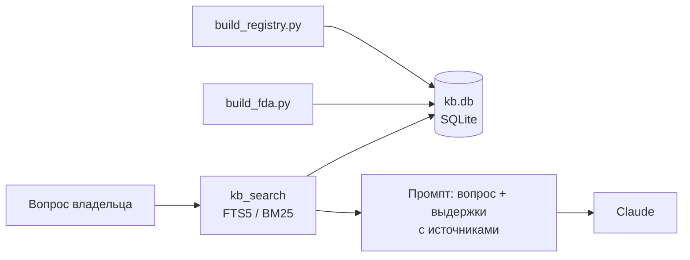

# RAG-лаборатория VetCheck

Тестовая среда для базы знаний бота: проверяю, становятся ли ответы точнее, если модели подложить выдержки из официальных источников. **В прод пока не подключено**, бот отвечает без базы.

## Источники

| Источник | Что берём | Лицензия |
|---|---|---|
| [FDA, Center for Veterinary Medicine](https://www.fda.gov/animal-veterinary) | Страницы для владельцев собак и кошек: токсины, обезболивающие, паразиты, корма | Общественное достояние (US Gov) |
| [Госреестр ветпрепаратов Россельхознадзора](https://fsvps.gov.ru/otkrytaya-sluzhba/otkrytye-dannye/) | Препараты для собак и кошек: показания, противопоказания, побочные действия | Открытые данные |

Тексты FDA на английском. Фрагменты переводятся на русский через Claude Haiku, оригинал хранится рядом, в ответе указывается ссылка на страницу FDA.
В реестре поле «Дозировка» означает содержание действующего вещества, а не схему применения. Поэтому на вопрос «сколько давать» база не отвечает, и это заложено в промпт.

## Как устроено



- **Поиск:** SQLite FTS5 (BM25) без эмбеддингов, грубый русский стемминг по окончаниям, словарь брендов латиница → кириллица (Bravecto → бравекто).
- **Ранжирование:** если в вопросе назван препарат, его карточка идёт первой. Из одного документа FDA берётся не больше двух фрагментов, чтобы один источник не заглушил остальные.
- **Промпт:** опираться на выдержки и называть источник. Числа и дозировки брать только из источников, если их там нет — отправлять к ветеринару.

## Оценка

`ask_lab.py --batch` прогоняет вопросы из `test_questions.json` (ксилит, ибупрофен, лилии, антипаразитарные препараты, парацетамол для кошки и др.) дважды, без базы и с базой, и сохраняет отчёт сравнения. Пример: [`reports/report_20261007_1835.md`](reports/report_20261007_1835.md).

## Запуск

```bash
pip install -r requirements.txt
python build_registry.py           # реестр -> kb.db (CSV скачать с fsvps.gov.ru в raw/)
python build_fda.py fetch          # страницы FDA -> raw/fda/
python build_fda.py translate      # перевод фрагментов -> kb.db (нужен ANTHROPIC_API_KEY)
python ask_lab.py "вопрос" --compare
```

`ask_lab.py` вызывает агента бота (`claude_agent.py`) с его боевым системным промптом. Код бота закрыт, поэтому в этом репозитории сравнение целиком не запустится. Поиск (`kb_search.py`) и сборка базы работают самостоятельно.
